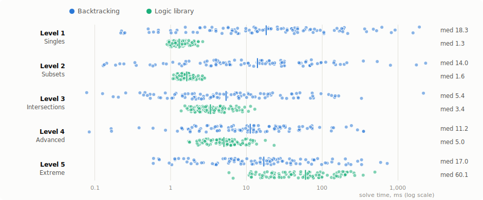
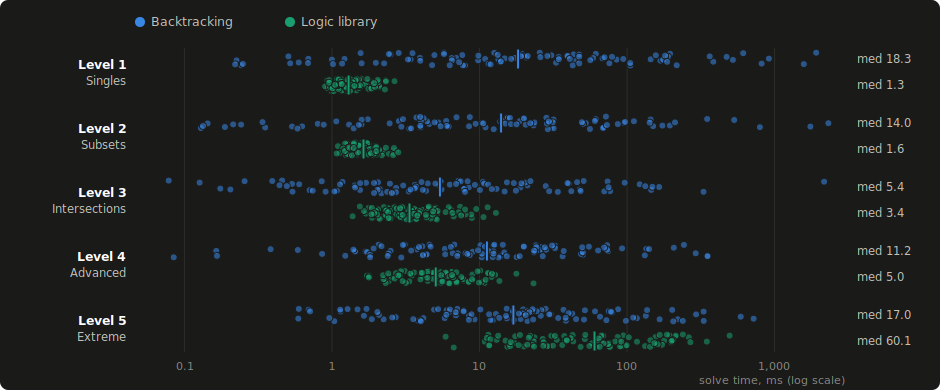
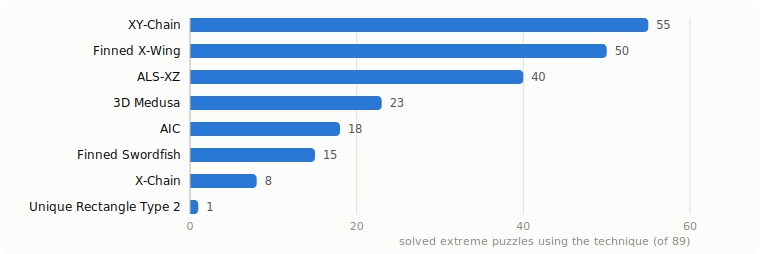
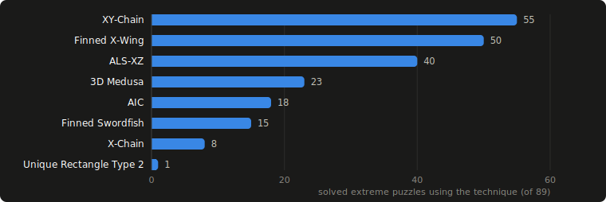

Benchmark
=========

The repository ships a reproducible benchmark: 500 unique-solution puzzles
(seed 42), 100 for each of five difficulty levels, timed against the
lightest classic backtracking solver (bitmask, sequential cells, no
heuristics) with an identical protocol — puzzle string in, board out,
minimum of 3 runs, parsing included.

Solve-time distribution
-----------------------

.. list-table::
   :header-rows: 1

   * - Level
     - Solved (logic)
     - BT median
     - Library median
   * - 1 · Singles
     - 100/100
     - 18.3 ms
     - **1.3 ms**
   * - 2 · Subsets
     - 100/100
     - 14.0 ms
     - **1.6 ms**
   * - 3 · Intersections
     - 100/100
     - 5.4 ms
     - **3.4 ms**
   * - 4 · Advanced
     - 100/100
     - 11.2 ms
     - **5.0 ms**
   * - 5 · Extreme
     - 89/100
     - **17.0 ms**
     - 60.1 ms
   * - **Overall**
     - **489/500**
     - 12.0 ms
     - **2.8 ms**

On the 11 extreme puzzles the library cannot crack, its reported time is
the time to exhaust every technique and stop — never a guess.

Which techniques crack the extreme tier
---------------------------------------

Soundness validation
--------------------

Beyond timing, every deduction is machine-verified: placements must match
an independent backtracking solution and no elimination may ever remove a
true digit. The 1.0.0 release run — **100,000 generated puzzles (seeds
100 and 200), 98,687 solved by pure logic (98.7%), 1,313 stalled,
0 unsound steps.**

Reproduce everything from the repository root:

.. code-block:: bash

   python benchmark/generate_puzzles.py   # regenerate the dataset (seeded)
   python benchmark/run_benchmark.py      # times both solvers
   python benchmark/make_charts.py        # renders the SVG charts
   python benchmark/validate.py --count 100000 --seed 100 --jobs 8
